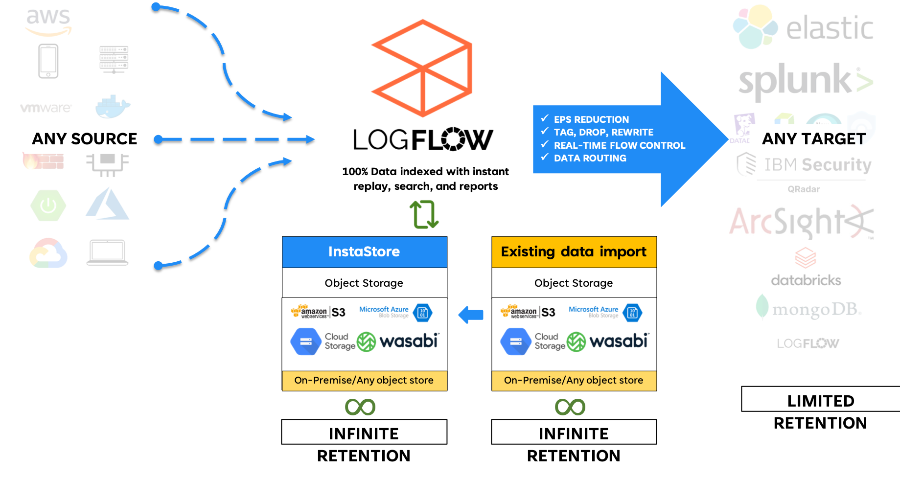
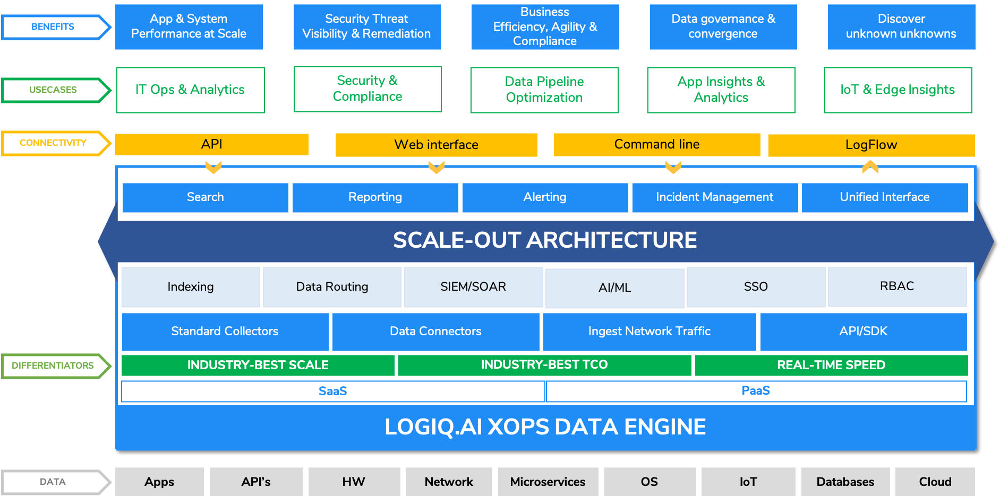

# Never Block, Never Drop

### <mark style="color:red;">Data loss</mark> in data pipelines

Data pipelines have the interesting problem of dealing with the source, problems at the forwarding destination, and managing their own scale and reliability. A pipeline inadequately sized for storage and elasticity means one simple thing - **data loss.**

Sources of data can cause sudden increases in data bursts for a variety of reasons such as an error scenario causing lots of log data to be generated, more users coming live, etc. to name a few.&#x20;


### Don't accept data loss!


#### Never Block

An observability pipeline needs to be elastic to support such scenarios. Causing the source of the data to block because the pipeline does not have adequate storage or cannot scale up elastically will lead to data loss. Most sources of data do not have infinite storage either and will eventually rotate their pending logs to prevent running out of disk space. This can mean loss of critical data that could be holding information about an application failure, a security attack, a performance issue, etc. **Block the sender is not an acceptable feature or architecture for data pipeline platforms** except in the most extreme of circumstances like a major disaster event such as the data center going offline.

#### Never Drop

When forwarding data to target systems, it is not uncommon to have network partitions, services go offline at the target causing the data pipeline to now have data coming in but no place to send the data out. The unfortunate reality of DIY pipelines and software solutions that are emerging is to drop the data! For an enterprise that is running critical data through these pipelines that contain valuable data on their production systems, security, and compliance insights, this has to be unacceptable. yet Drop data seems to have become an acceptable feature documented by some vendors who implement data pipelines.

#### Infinite data reservoir

The only way to address the pipeline source and destination mismatch is to have an attached infinite data reservoir. This has traditionally not been possible due to the limitations of disk-based designs.&#x20;

Apica solves this with InstaStore. Our storage layer is built on an object-store as a primary storage layer, but unlike most approaches to using object storage, which use it as a secondary tier, we use it as a primary tier and index 100% of the data. All our data as well as metadata is stored in object storage.

Our approach provides instant elasticity in terms of storage requirements with ZeroStorageTax. No need to expand storage, throttle senders, scramble to handle more throughput needs. It is infinite and always attached to the LogFlow system.

#### Elastic architecture

An elastic design is needed to ensure that data sources sending more data can be handled by the data pipeline without any manual intervention. Not doing so will lead to data backlogs on the source and cause data loss in the event the backlog build-up for long durations.

### <mark style="color:green;">"Never Block"</mark> and <mark style="color:green;">"Never Drop"</mark> with <mark style="color:green;">InstaStore</mark>

We built our InstaStore to handle the challenges faced by enterprises in high-volume environments. 100% of all data coming in LogFlow is written to InstaStore before being forwarded. InstaStore provides an infinite storage layer by abstracting storage as an API and building on top of any object-store.

Build your data pipelines from day 0 with infinite storage that can act as an endless store for throughput mismatches on either the source or the target. Any data in the InstaStore can be instantly replayed to a target on demand. <mark style="color:green;">**Never block or never drop data with InstaStore.**</mark>

### Elastic architecture with Kubernetes

Apica's LogFlow is built on Kubernetes and works with Cluster Autoscaling and Horizontal Pod Autoscaling providing instant throughput on-demand in high volume data environments.

