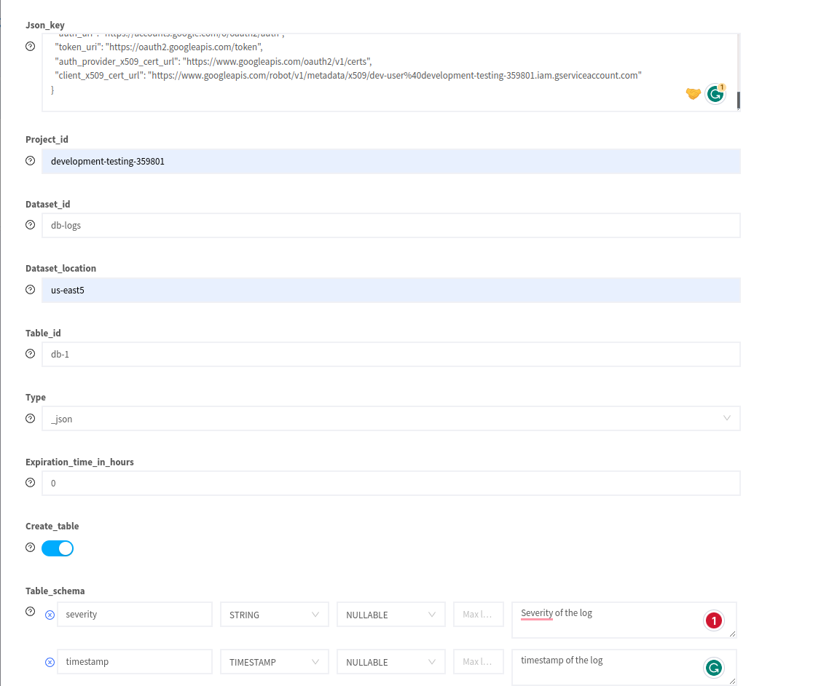

# GCP Bigquery

## Pre-Requisite

* Project in GCP
* IAM Role which has access to big query service

## Create Bigquery Forwarder

* Navigate to `create forwarder` page
* Select `bigquery` forwarder
* Provide the credentials for the IAM role as JSON  in `json_key` field
* Provide `project_id`, `dataset_id` and `table_id`
* Set `table_expiration` in hours which will delete the table after the specified expiration time
* Enable the `create_table` toggle to define the schema for the table
* Add required columns for the table
* Provide `name` for the forwarder and click `create`

<figure><figcaption></figcaption></figure>

## Create Bigquery Forwarder with existing table

* Select `bigquery` forwarder
* Provide the credentials for the IAM role as JSON  in `json_key` field
* Provide `project_id`, existing`dataset_id` and  existing`table_id`
* Set `table_expiration` in hours which will delete the table after the specified expiration time
* Disable the `create_table` toggle to define the schema for the table
* Provide `name` for the forwarder and click `create`

## Add Column to Biquery Table

* Navigate to `forwarders` page
* Click `edit` icon in the big query forwarder for which you need to add columns in the schema
* Click on `add column` to update the schema

<figure><figcaption></figcaption></figure>

## Mapping logs to Bigquery table

When you forward your logs to BigQuery, the fields in the log will be mapped to the column in the table. By default, LogiqAI maps the schema from the forwarder to the facet in the logs. It will insert the value for the facet as a value to the column in the table.

<figure><figcaption>
facets
</figcaption></figure>

<figure><figcaption>
Columns in bigquery table
</figcaption></figure>

To change the default mapping behavior, [create a forward rule](https://docs.logiq.ai/data-management/forward) for the namespace and application by renaming the facet with the column name. This will help you to manage the mappings between your log and the BigQuery table schema.

