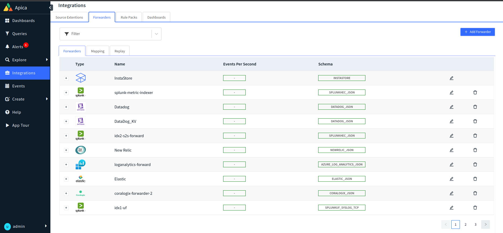

# Coralogix Forwarding

### Pre-Requisites

* User should have an account in Coralogix platform
* Private key to ingest data into coralogix. To create a private key in coralogix, please refer to this link [https://coralogix.com/docs/send-your-data-api-key/](https://coralogix.com/docs/send-your-data-api-key/)

### Steps to Forward logs to Coralogix

* Navigate to `create forwarder` page
* Select Coralogix
* Click on `Create Forwarder`
* Provide forwarder name
* Provide `Private Key` for ingesting logs
* Click `Create` button

After the creation of forwarder, it can be mapped to any namespace and application which sends logs to coralogix platform.
