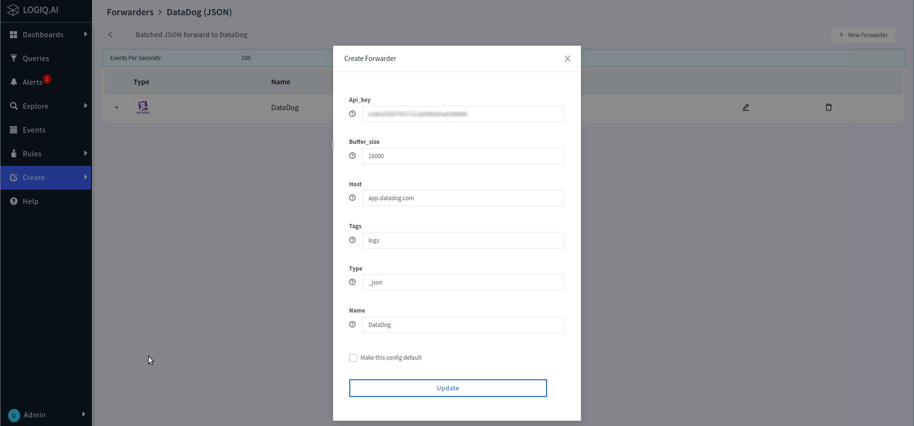

# DataDog Forwarding

Generating API Key from DataDog

Generating an API key from DataDog is a simple process that allows you to securely access data from the platform.

To add a Datadog API key or client token:

1. Navigate to Organization settings, then click the **API keys** or **Client Tokens** tab.
2. Click the **New Key** or **New Client Token** button, depending on which you’re creating.
3. Enter a name for your key or token.
4. Click **Create API key** or **Create Client Token**.

For more details on how to generate API key in DataDog you can visit this [link](https://docs.datadoghq.com/account\_management/api-app-keys/).

To forward your logs to DataDog, begin by logging into LOGIQ.AI's website.

* Navigate to the **`Create`** tab and select the option for **`Forwarder`**.
* Next, choose **`DataDog(JSON)`** from the available options; this will bring up a new form with fields such as `API Key`, `Buffer Size`, `Host` and `Tags`. Fill out the required data in these fields and click **`Create`**.

Create Forwarder:

<pre><code><strong>Api_Key:       &#x3C;DATADOG-API-KEY>
</strong>Buffer_size:   16000
Host:          app.datadog.com
Tags:          logs
Type:          _json
Name:          DataDog Forwarder
</code></pre>

* Next, head over to the **`Explore`** page and pick out a namespace you wish to forward your logs to DataDog from.
* Click on the three dots icon located next to the calendar and opt for **`Map Forwarder`**; this will open a new modal which allows you to choose the newly created DataDog forwarder schema (this can be identified via its datadog icon).
* Confirm your selection by clicking **`OK`**.
* A successful mapping is indicated by a popup showing that `namespace-application pairs are connected with respective forwarders`; additionally, you'll notice an updated Namespace Forwarder status in effect.
* Your logs are now being forwarded to DataDog.

> To help make the steps easier to understand, below are the screenshots illustrating each of the instructions given above.

<figure><figcaption>
Create -> Forwarder
</figcaption></figure>

<figure><figcaption>
Create Forwarder Modal
</figcaption></figure>

<figure><figcaption>
Explore Page, selected Windows Namespace
</figcaption></figure>

<figure><figcaption>
Map Forwarder
</figcaption></figure>

<figure><figcaption>
Selecting the DataDog Forwarder
</figcaption></figure>

