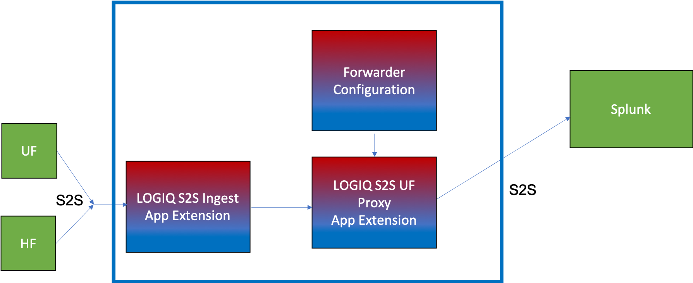

# Overview

LOGIQ.AI's plugins include creating one or more Splunk Output configurations that can be then used to send data to Splunk. We support all the enterprise modes for forwarding, including sending data to a Standalone Server, a list of indexers, and sending data to indexers using Peer discovery.

### Architecture

<figure><figcaption>
LOGIQ Splunk Forwarding components
</figcaption></figure>

The Splunk plugin for output configurations can be launched from the _App Extensions_ section under _Explore_.

<figure><figcaption></figcaption></figure>

Selecting the _"Forwarding Proxy"_ app, gives you the configured proxies as well as the ability to create a new one.

You can expand on the proxy to see its settings. The "hec\_token" can be used to setup the forwarder.

<figure><figcaption></figcaption></figure>

